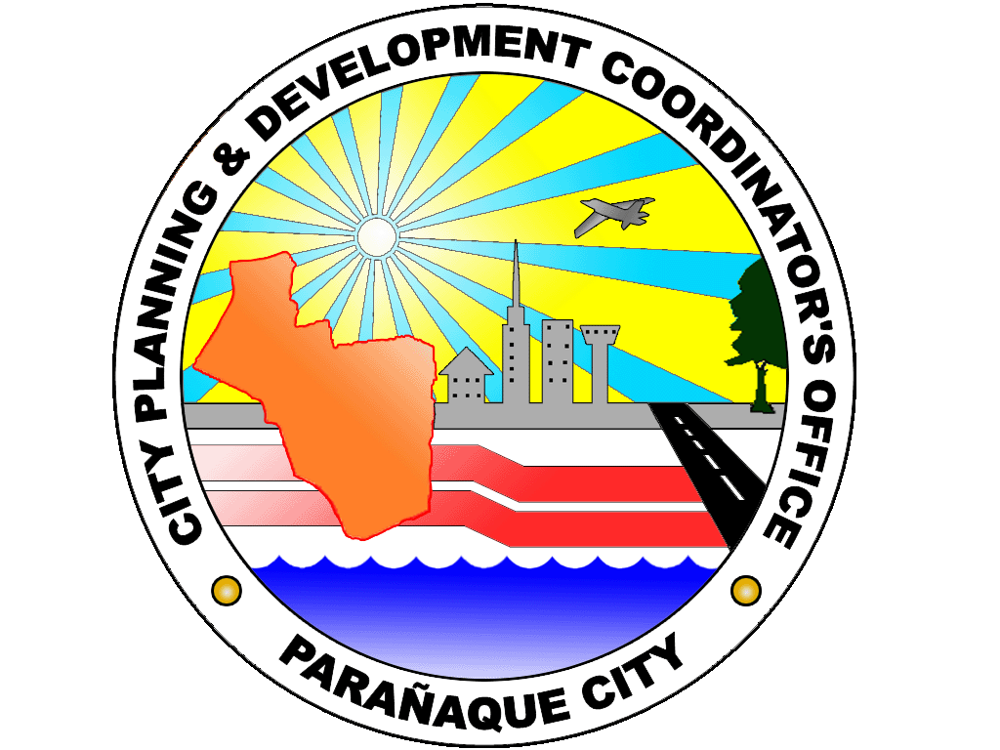

    

<h1 align="center" style="font-weight: bold;">City Planning Monitoring System</h1>

In development

A website to be utilized by **Admins** and **Implementation Leads**. This is in hopes to streamline the process of processing the *AIP* and *Project Monitoring*

## Stack Utilized

- Next.js

### Libraries Used

#### UI

- shadcn
- tabler icons (to be implemented)

## Features
- AIP and Project Monitoring has excel-like editing
- Admin comments to catch issues
- Admins can generate links for Implementation Leads
- Implementation Leads can upload **AIP** and edit their uploads
